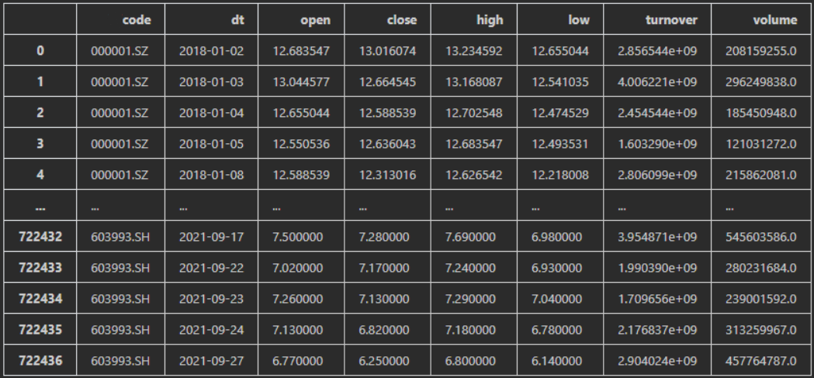

# MPS

The project is the code of Multi-scale Time Based Stock Appreciation Ranking Prediction via Price Co-movement Discrimination (https://link.springer.com/chapter/10.1007/978-3-031-00129-1_39).

### build_data.ipynb

The script is the pre-process of stock data. The requirement of stock  data is a dataframe contains cokdcode(stock_code), date, open price, close price, high price, low price, turnover and volume of a stock. The data samples are as follows:

Then the script transform data to a pkl file.

### MPS.ipynb

This is the main code of MPS model. The input the pkl file obtained by build_data.ipynb. And The code contains the train and prediction part.

